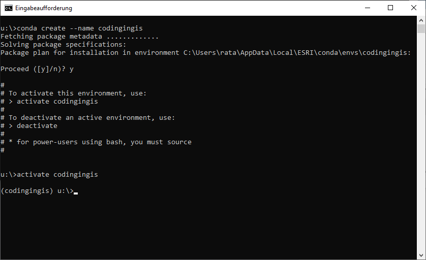
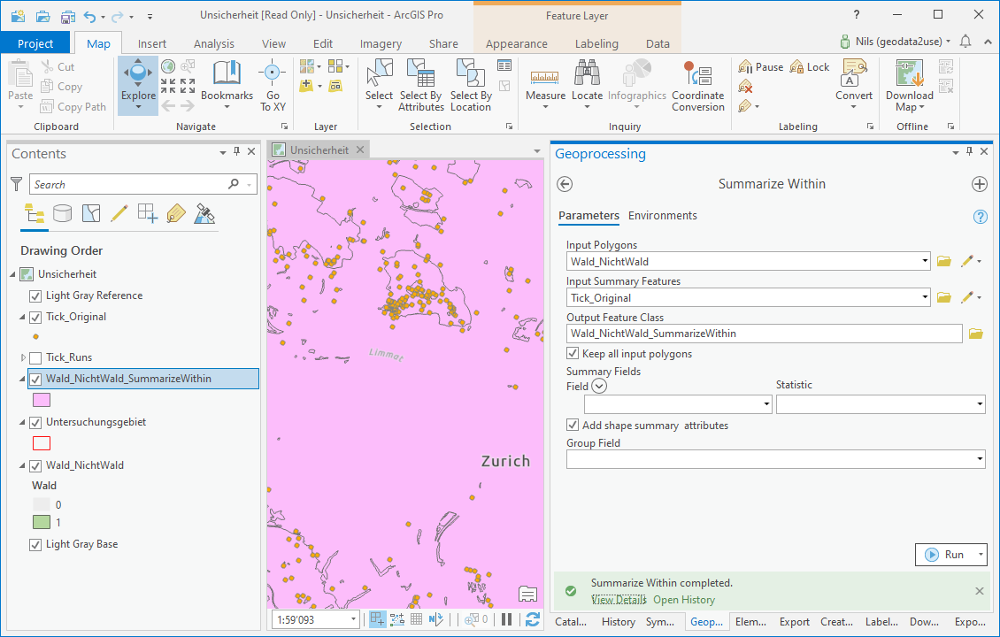

BScUmweltingenieurwesen

AngewandteGeoinformatik | HS 2020

# Coding in GIS II

# Nils Ratnaweera
Forschungsgruppe Geoinformatik
 
Institut für Umwelt und Natürliche Ressourcen	
ZHAW Zürcher Hochschule für Angewandte Wissenschaften
Grüental, Postfach, CH-8820 Wädenswil
 
rata@zhaw.ch

# Zeitplan

# Lernziele

* Ihr wisst was Python Erweiterungen / Module sind und wie man sie installiert
* Ihr kennt das Konzept vonCondaEnvironments
* Ihr wisst was eine «Working Directory» ist und könnt diese abfragen und setzen

# Heute

__Python Erweiterungen / Module__

Virtual Environments

Conda

Condamit ArcGIS

Leistungsnachweis

# Python Erweiterungen / Module

Erweiterung aus einem

Reposoritory   _installieren_ 

Erweiterung Laden

Spezialisten/innen

Projekt «Haus bauen»

# Heute

Python Erweiterungen / Module

__Virtual Environment__

Conda

Condamit ArcGIS

Leistungsnachweis

# Virtual Environment

Ohne Virtual Environments:

Alles wird an einem zentralen Ort installiert

Viele Erweiterungen

mit Virtual Environments

Verschiedene «Umgebungen» die

voneinanderunabhängigsind

wiederverwendbarsind

Viele Erweiterungen

# Heute

Python Erweiterungen / Module

Virtual Environment

__Conda__

Condamit ArcGIS

Leistungsnachweis

# Conda

* Was kann «Conda»?
  * Erstellen und verwalten von «Virtual Environments»
  * Installation von Erweiterungen («Python Modules»)
* Wie nutzt man «Conda»?
  * Schritt 1: Software herunterladen und installieren
  * Schritt 2: Systemvariable setzen falls nötig
  * Schritt 3: eine «Virtual Environment» erstellen
  * Schritt 4: die «Virtual Environment» aktivieren
  * Schritt 5: Modul installieren

* __Schritt 1: Software herunterladen und installieren__
* _conda_ wird in zwei verschiedenen Varianten angeboten:
  * «Miniconda»:
    * nur das Programm _conda_
    * Ohne grafisches User Interface
    * Klein (50 – 100mb)
    * Wird mit ArcGIS Pro mitgeliefert
  * «Anaconda»:
    * Das Programm _conda_
    * Inkl. häufig genutzt Modules
    * Inkl. einem Grafisches User Interface
    * Gross (300 – 500 MB)

* __Schritt 2: Systemvariable setzen falls nötig__
* Condaist ein Programm, welches von der Kommandozeile aus bedient wird (cmdin Windows)
* Dafür muss die Konsole wissen, wo das Programm installiert ist
* Um zu prüfen, ob dies der Fall ist kann folgendermassen getestet werden:
  * Konsole starten (Widowstaste+cmd)
  * Folgendes eingeben:conda–version
  * Versionsnummer / Error 

__Schritt 2: Systemvariable setzen falls nötig__

Wird ein Programm in der Konsole aufgerufen, wird nach diesem Programm in verschiedenen Ordnern gesucht

Welche Ordner dies sind, wird in derUmgebungvariablenfestgehalten

Wir müssen denconda-Pfad also ausfindig machen und in denUmgebungsvariabelnfesthalten

__Schritt 2: Systemvariable setzen falls nötig__

Wenn ihr auf Windows arbeitet und ArcGIS installiert habt, istcondavermutlich hier installiert:

C:\Program Files\ArcGIS\Pro\bin\Python\Scripts

__Schritt 2: Systemvariable setzen falls nötig__

__Schritt 2: Systemvariable setzen falls nötig__

__Schritt 2: Systemvariable setzen falls nötig__

__Schritt 2: Systemvariable setzen falls nötig__

Nun sollte «conda» betriebsbereit sein

Konsole starten (cmd):>>conda--versionconda4.3.27

Wenn dies Funktioniert, können wir eine erste «condaenvironment» erstellen

__Schritt 3:__  __Conda__  __environment__  __erstellen__

condacreate--namecodingingis

__Schritt 3:__  __Conda__  __environment__  __erstellen__

conda create--namecodingingis

Ruft das Programm «conda» auf

__Schritt 3:__  __Conda__  __environment__  __erstellen__

conda create --namecodingingis

Ruft den Befehl «create» auscondaauf

Der «create» Befehl erstellt eben diese neue Environment in einem Standartverzeichnis

__Schritt 3:__  __Conda__  __environment__  __erstellen__

condacreate --name codingingis

Kündigt an, dass gleich der Name der neuen Umgebung definiert wird

__Schritt 3:__  __Conda__  __environment__  __erstellen__

condacreate--name codingingis

Bestimmt, das der Name der neuen Umgebung «codingingis» lauten soll

Speicherort: C:\Users\rata\AppData\Local\ESRI\conda

Mit "y" bestätigen

__Schritt 4: Environment aktivieren__

activatecodingingis

«Aktiviert» die Environment mit dem Namen «codingingis»

__Schritt 5: Modul installieren__

__Schritt 5: Modul installieren__

conda install -c conda-forge pandas

Befehl um «pandas» zu installieren

Findet man über eine kurzeGooglesuche

__Schritt 5: Modul installieren__

conda install -c conda-forge pandas

Ruft das Programm «conda» auf

__Schritt 5: Modul installieren__

conda install -c conda-forge pandas

Ruft den Befehl «install» inCondaauf

__Schritt 5: Modul installieren__

conda install -c conda-forge pandas

Gibt an, dass jetzt gleich der «Channel» angegeben wird

Der Channel ist das «Repository»

__Schritt 4: Modul installieren__

conda install -c conda-forge pandas

Ist der Name des «channels»

__Schritt 5: Modul installieren__

conda install -c conda-forge pandas

Der Name des Moduls, dass man installieren möchte

__Schritt 5: Modul installieren__

* __Schritt 5: Modul installieren__
* Für Coding in GIS I – III brauchen wir folgende Module:
  * jupyterlab,pandas,matplotlib,geopandas,descartes
  * Immer nach dem gleichen Syntax:condainstall-c conda-forge pandas
* Sobaldjupyterlabinstalliertist,könntihrdieAnwendungmitfolgendemBefehlin dieKonsolestarten:jupyterlab

__Modul Importieren__

zB  .  import  pandas

__Working Directory__

wo diePythonscripts/Notebooks sind

Ist v.a. beim einlesen / ausgeben von Dateien wichtig

kann mitos.getcwd()ermittelt werden

__Warum verbringen wir so viel Zeit mit__  __conda__  __?__

Der sichere Umgang mitCondaist eine gute Basis für eine harmonische Python-Beziehung

Conda(o.ä.) wird in vielen Python Kursen / Tutorials vorausgesetzt und unzureichend erklärt

Mitcondakönnen wir zwei Welten miteinander Verbinden

# Heute

Python Erweiterungen / Module

Virtual Environment

Conda

__Conda__  __mit ArcGIS__

Leistungsnachweis

# Conda mit ArcGIS

arcpy.analysis.SummarizeWithin("Wald_NichtWald", "Tick_Original",r"C:\unsicherheit.gdb\summary", "KEEP_ALL", None, "ADD_SHAPE_SUM", '', None, "NO_MIN_MAJ", "NO_PERCENT", None)

# Heute

Python Erweiterungen / Module

Virtual Environment

Conda

Condamit ArcGIS

__Leistungsnachweis__

# Leistungsnachweis

Gemeinsam kommende Woche (Coding in GIS III):

Monte Carlo Simulation mit den Zeckenstichdaten

Systematik gleich wie in «Datenqualität und Unsicherheit»

Neu: Alles in Python (auch die Erstellung der Simulierten Daten)

Zeckenstichmeldungen

Zufällig verteilen

Zeckenstiche _im_ Wald ermitteln

Mittelwert /Verteilungder Anteile darstellen

Eure Leistung

Erstellen eines geordneten, __kommentierten__ Reports

InJupyterLabs mitJupyterNotebook (Python undMarkdown)

Experimentieren mit verschiedenen Radien

Visualisierung der Daten

# Zeitplan

# 

__https://ratnanil.github.io/codingingis/__

# Keep your code tidy!

importpadnasaspd

pd.read_csv("zeckenstiche.csv")

importpandasaspd

zeckenstiche=pd.read_csv("zeckenstiche.csv")

os.chdir("'C:\\Users\\rata\\switchdrive\\Lehre\\Bachelor\\AGI\\MyBinderRepo\\source\\notebooks2py'")

os.getcwd()

importos

zeckenstiche=pd.read_csv("Zeckenstiche.csv")

zeckenstiche=pd.read_csv("Zeckenstiche.txt")

zeckenstiche=pd.read_csv("zeckenstiche.txt")

import  padnas  as  pd

pd.read_csv("zeckenstiche.csv")

import  pandas  as  pd

zeckenstiche=pd.read_csv("zeckenstiche.csv")

os.chdir("'C:\\Users\\rata\\switchdrive\\Lehre\\Bachelor\\AGI\\MyBinderRepo\\source\\notebooks2py'")

os.getcwd()

import  os

zeckenstiche=pd.read_csv("Zeckenstiche.csv")

zeckenstiche=pd.read_csv("Zeckenstiche.txt")

zeckenstiche=pd.read_csv("zeckenstiche.txt")

importpadnasaspd

importpandasaspd

importos

pd.read_csv("zeckenstiche.csv")

zeckenstiche=pd.read_csv("zeckenstiche.csv")

os.chdir("'C:\\Users\\rata\\switchdrive\\Lehre\\Bachelor\\AGI\\MyBinderRepo\\source\\notebooks2py'")

os.getcwd()

zeckenstiche=pd.read_csv("Zeckenstiche.csv")

zeckenstiche=pd.read_csv("Zeckenstiche.txt")

zeckenstiche=pd.read_csv("zeckenstiche.txt")

import  padnas  as  pd

importpandasaspd

importos

pd.read_csv("zeckenstiche.csv")

zeckenstiche=pd.read_csv("zeckenstiche.csv")

os.chdir("'C:\\Users\\rata\\switchdrive\\Lehre\\Bachelor\\AGI\\MyBinderRepo\\source\\notebooks2py'")

os.getcwd()

zeckenstiche  =  pd.read_csv  ("Zeckenstiche.csv")

zeckenstiche  =  pd.read_csv  ("Zeckenstiche.txt")

zeckenstiche  =  pd.read_csv  ("zeckenstiche.txt")

importpandasaspd

importos

pd.read_csv("zeckenstiche.csv")

zeckenstiche=pd.read_csv("zeckenstiche.csv")

os.chdir("'C:\\Users\\rata\\switchdrive\\Lehre\\Bachelor\\AGI\\MyBinderRepo\\source\\notebooks2py'")

os.getcwd()

importpandasaspd

importos

pd.read_csv("zeckenstiche.csv")

zeckenstiche=pd.read_csv("zeckenstiche.csv")

os.chdir  ("'C:\\Users\\rata\\  switchdrive  \\Lehre\\Bachelor\\AGI\\  MyBinderRepo  \\  source  \\notebooks2py'")

os.getcwd  ()

importpandasaspd

importos

os.getcwd()

os.chdir("'C:\\Users\\rata\\switchdrive\\Lehre\\Bachelor\\AGI\\MyBinderRepo\\source\\notebooks2py'")

pd.read_csv("zeckenstiche.csv")

zeckenstiche=pd.read_csv("zeckenstiche.csv")

importpandasaspd

importos

os.getcwd()

os.chdir("'C:\\Users\\rata\\switchdrive\\Lehre\\Bachelor\\AGI\\MyBinderRepo\\source\\notebooks2py'")

pd.read_csv  ("zeckenstiche.csv")

zeckenstiche=pd.read_csv("zeckenstiche.csv")

importpandasaspd

importos

os.getcwd()

os.chdir("'C:\\Users\\rata\\switchdrive\\Lehre\\Bachelor\\AGI\\MyBinderRepo\\source\\notebooks2py'")

zeckenstiche=pd.read_csv("zeckenstiche.csv")

importpandasaspd

importos

# wo ist das  current  working  directory  ?

os.getcwd()

# ich muss das CWD manuell setzen:

# TODO: in einem  Spyder  -Projekt arbeiten

os.chdir("'C:\\Users\\rata\\switchdrive\\Lehre\\Bachelor\\AGI\\MyBinderRepo\\source\\notebooks2py'")

# Zeckenstichdaten aus "Datenqualität und Unsicherheit"

pd.read_csv("zeckenstiche.csv")

zeckenstiche=pd.read_csv("zeckenstiche.csv")

